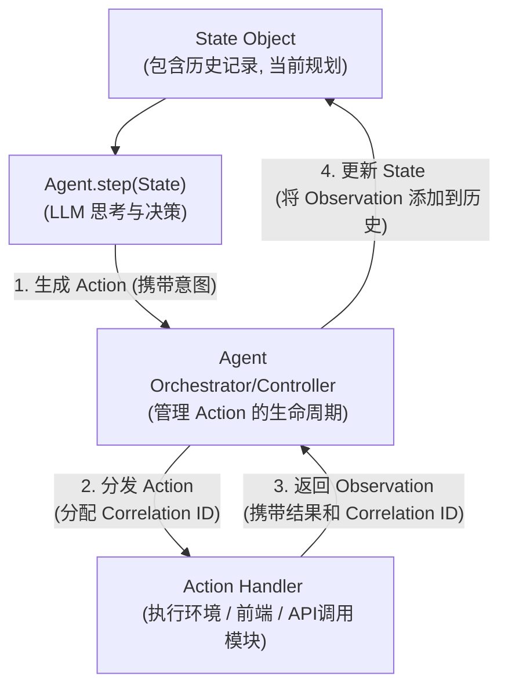

# AI Agent 设计核心概念与流程解析

本文档总结了关于 AI Agent（特别是类似 OpenHands 项目中的 CodeActAgent）设计的核心概念、交互流程、状态管理、持久化策略以及内部工作机制的讨论。

## 1. Agent 核心交互流程

Agent 的工作本质上是一个"思考-行动-观察-再思考"的循环。

**流程说明:**

1.  **`State` 对象**: Agent 的"记忆"，包含所有历史交互和当前任务规划。
2.  **`Agent.step(State)`**: Agent 的核心决策单元，通常利用 LLM 基于当前 `State` 思考并决定下一步行动，产出 `Action`。
3.  **Agent Orchestrator/Controller**: 系统的"交通指挥员"，接收 `Action`，为其分配追踪标识 (`Correlation ID`)，并将其分发给合适的执行单元。
4.  **Action Handler**: 实际执行 `Action` 的模块（如代码执行环境、前端交互接口、第三方 API 调用模块）。执行后返回包含结果和 `Correlation ID` 的 `Observation`。
5.  **Orchestrator 更新 State**: Orchestrator 接收 `Observation`，通过 `Correlation ID` 关联到原 `Action`，并用此 `Observation` 更新 `State` 对象，驱动 Agent 进入下一轮思考。

## 2. Agent Orchestrator/Controller 的职责

Orchestrator (或 Controller) 是 Agent 系统能够有序、有效地完成任务的核心协调者。主要职责包括：

*   **任务生命周期管理**: 从任务接收到完成/中止的全程管理。
*   **Agent 调用与交互**: 在合适时机调用 `agent.step()`，并提供完整的 `State` 上下文。
*   **Action 处理与路由**:
    *   接收 Agent 生成的 `Action`。
    *   分配 `Correlation ID` (或确保可追踪)。
    *   判断 `Action` 类型并分发给正确的执行单元（Runtime, 前端接口, API Handler）。
*   **Observation 收集与关联**:
    *   从各执行单元收集 `Action` 执行后产生的 `Observation`。
    *   通过 `Correlation ID` 将 `Observation` 与触发它的 `Action` 精确关联。
*   **状态管理与更新**:
    *   将新的 `(Action, Observation)` 对或相关事件更新到核心 `State` 对象中。
*   **控制流管理**: 维护 Agent 的核心循环，处理并发和错误。

**与 React 协调器的类比**:

*   **相似处**: 都是管理复杂流程、处理异步操作、状态驱动、充当中央控制点。
*   **不同处**: 核心领域（智能任务执行 vs UI渲染）、工作单元性质、智能来源、交互模型和错误处理的复杂性不同。

## 3. 状态管理 (State Management)

`State` 对象是 Agent 的"记忆"和决策基础。

### 3.1. `State` 对象的构成 (以 OpenHands 为例推测)

*   `session_id: str`: 当前会话的唯一标识。
*   `plan: Plan` <!-- 由 Agent 内部管理或通过 `inputs` 间接定义, 非 `State` 对象直接的持久化属性 (详见 5.2 节) -->
*   `iteration: int`: Agent 已执行的迭代次数。
*   `history: List[Event]`: **核心部分**，按时间顺序记录了所有已发生的 `Event` 对象 (即 `Action` 和对应的 `Observation`)。
*   其他元数据。

### 3.2. `Action` 与 `Observation`

*   **`Action`**: 代表 Agent 的意图或用户/系统的输入。
    *   `id: int`: `Action` 的唯一标识 (作为 `Event` 继承而来, 由 `EventStream` 分配)。
    *   `type/class`: 表明 `Action` 的种类 (如 `CmdRunAction`, `MessageAction`, `AgentFinishAction`)。在 OpenHands 中具体体现为 `action: str` 字段。
    *   `payload/content`: `Action` 的具体内容 (如命令字符串、消息文本)。在 OpenHands 中通常体现为 `args` 字典或特定字段。
    *   `source`: 标记来源 (agent, user)。
*   **`Observation`**: 代表 `Action` 执行后的结果或外部事件。
    *   `type/class`: 表明 `Observation` 的种类 (如 `CmdOutputObservation`, `UserMessageObservation`, `AgentErrorObservation`)。在 OpenHands 中具体体现为 `observation: str` 字段。
    *   `content/payload`: `Observation` 的具体内容 (如命令输出、用户消息文本)。
    *   `cause: Optional[int]`: **关键关联字段**，存储了触发此 `Observation` 的那个 `Action` 的 `id` (作为 `Event` 继承而来)。

### 3.3. 状态驱动机制

*   当新的 `Observation` (来自代码执行结果、用户输入、API 响应等) 产生并被 Orchestrator 用来更新 `State` 对象 (尤其是 `State.history`) 时，这个变化会驱动 Orchestrator 调用 `agent.step(newState)`。
*   Agent 基于更新后的 `State`（包含最新的 `Observation`）重新评估局势，做出新的决策，并产生新的 `Action`。
*   这个循环（`State` 变化 -> Agent 思考 -> 新 `Action` -> 执行 `Action` -> 新 `Observation` -> `State` 再变化）是 Agent 不断前进的动力。
