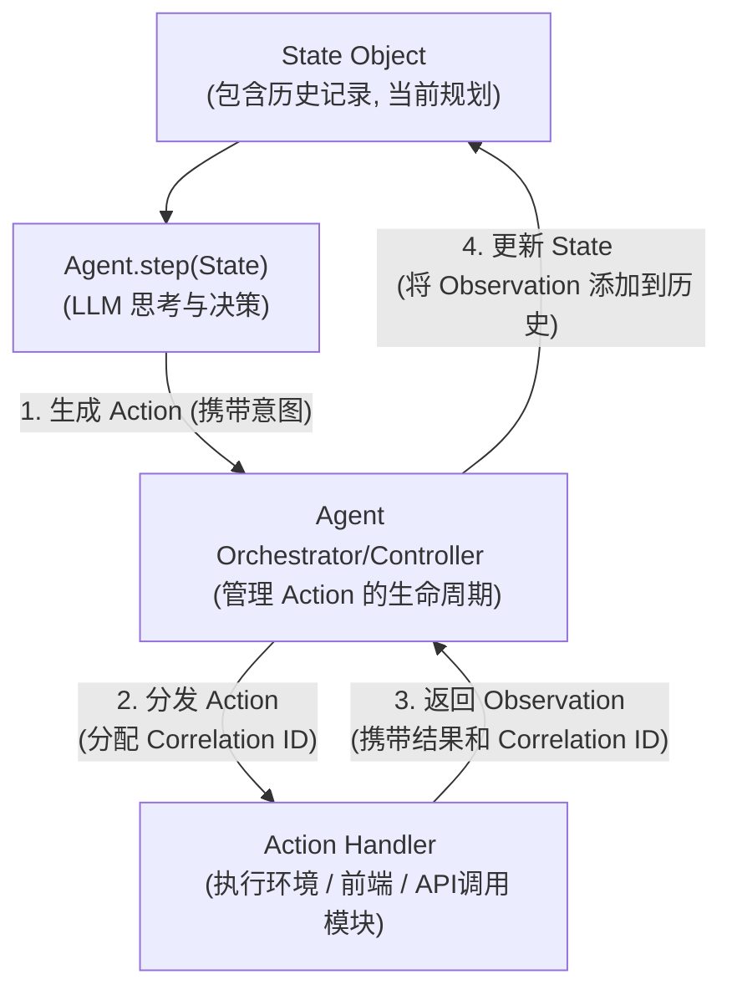
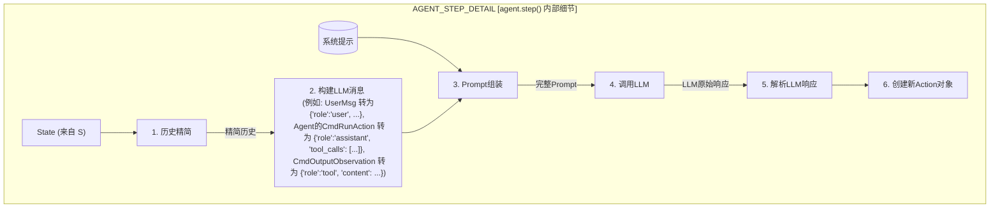
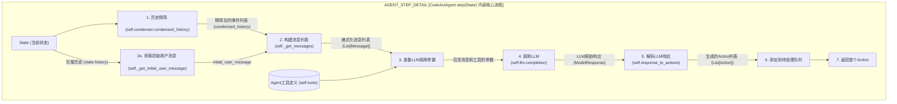
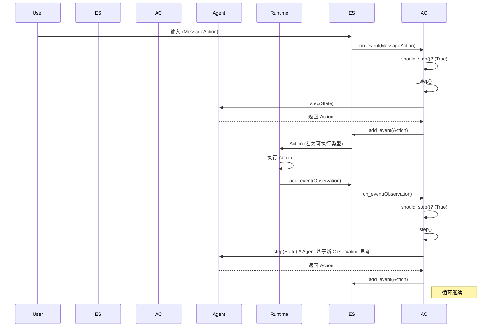

# AI Agent 设计核心概念与流程解析

本文档总结了关于 AI Agent（特别是类似 OpenHands 项目中的 CodeActAgent）设计的核心概念、交互流程、状态管理、持久化策略以及内部工作机制的讨论。

## 1. Agent 核心交互流程

Agent 的工作本质上是一个"思考-行动-观察-再思考"的循环。

**流程说明:**

1.  **`State` 对象**: Agent 的"记忆"，包含所有历史交互和当前任务规划。
2.  **`Agent.step(State)`**: Agent 的核心决策单元，通常利用 LLM 基于当前 `State` 思考并决定下一步行动，产出 `Action`。
3.  **Agent Orchestrator/Controller**: 系统的"交通指挥员"，接收 `Action`，为其分配追踪标识 (`Correlation ID`)，并将其分发给合适的执行单元。
4.  **Action Handler**: 实际执行 `Action` 的模块（如代码执行环境、前端交互接口、第三方 API 调用模块）。执行后返回包含结果和 `Correlation ID` 的 `Observation`。
5.  **Orchestrator 更新 State**: Orchestrator 接收 `Observation`，通过 `Correlation ID` 关联到原 `Action`，并用此 `Observation` 更新 `State` 对象，驱动 Agent 进入下一轮思考。

## 2. Agent Orchestrator/Controller 的职责

Orchestrator (或 Controller) 是 Agent 系统能够有序、有效地完成任务的核心协调者。主要职责包括：

*   **任务生命周期管理**: 从任务接收到完成/中止的全程管理。
*   **Agent 调用与交互**: 在合适时机调用 `agent.step()`，并提供完整的 `State` 上下文。
*   **Action 处理与路由**:
    *   接收 Agent 生成的 `Action`。
    *   分配 `Correlation ID` (或确保可追踪)。
    *   判断 `Action` 类型并分发给正确的执行单元（Runtime, 前端接口, API Handler）。
*   **Observation 收集与关联**:
    *   从各执行单元收集 `Action` 执行后产生的 `Observation`。
    *   通过 `Correlation ID` 将 `Observation` 与触发它的 `Action` 精确关联。
*   **状态管理与更新**:
    *   将新的 `(Action, Observation)` 对或相关事件更新到核心 `State` 对象中。
*   **控制流管理**: 维护 Agent 的核心循环，处理并发和错误。

**与 React 协调器的类比**:

*   **相似处**: 都是管理复杂流程、处理异步操作、状态驱动、充当中央控制点。
*   **不同处**: 核心领域（智能任务执行 vs UI渲染）、工作单元性质、智能来源、交互模型和错误处理的复杂性不同。

## 3. 状态管理 (State Management)

`State` 对象是 Agent 的"记忆"和决策基础。

### 3.1. `State` 对象的构成 (以 OpenHands 为例推测)

*   `session_id: str`: 当前会话的唯一标识。
*   `plan: Plan` <!-- 由 Agent 内部管理或通过 `inputs` 间接定义, 非 `State` 对象直接的持久化属性 (详见 5.2 节) -->
*   `iteration: int`: Agent 已执行的迭代次数。
*   `history: List[Event]`: **核心部分**，按时间顺序记录了所有已发生的 `Event` 对象 (即 `Action` 和对应的 `Observation`)。
*   其他元数据。

### 3.2. `Action` 与 `Observation`

*   **`Action`**: 代表 Agent 的意图或用户/系统的输入。
    *   `id: int`: `Action` 的唯一标识 (作为 `Event` 继承而来, 由 `EventStream` 分配)。
    *   `type/class`: 表明 `Action` 的种类 (如 `CmdRunAction`, `MessageAction`, `AgentFinishAction`)。在 OpenHands 中具体体现为 `action: str` 字段。
    *   `payload/content`: `Action` 的具体内容 (如命令字符串、消息文本)。在 OpenHands 中通常体现为 `args` 字典或特定字段。
    *   `source`: 标记来源 (agent, user)。
*   **`Observation`**: 代表 `Action` 执行后的结果或外部事件。
    *   `type/class`: 表明 `Observation` 的种类 (如 `CmdOutputObservation`, `UserMessageObservation`, `AgentErrorObservation`)。在 OpenHands 中具体体现为 `observation: str` 字段。
    *   `content/payload`: `Observation` 的具体内容 (如命令输出、用户消息文本)。
    *   `cause: Optional[int]`: **关键关联字段**，存储了触发此 `Observation` 的那个 `Action` 的 `id` (作为 `Event` 继承而来)。

### 3.3. 状态驱动机制

*   当新的 `Observation` (来自代码执行结果、用户输入、API 响应等) 产生并被 Orchestrator 用来更新 `State` 对象 (尤其是 `State.history`) 时，这个变化会驱动 Orchestrator 调用 `agent.step(newState)`。
*   Agent 基于更新后的 `State`（包含最新的 `Observation`）重新评估局势，做出新的决策，并产生新的 `Action`。
*   这个循环（`State` 变化 -> Agent 思考 -> 新 `Action` -> 执行 `Action` -> 新 `Observation` -> `State` 再变化）是 Agent 不断前进的动力。

### 3.4. 处理需要用户输入的 Action (异步非阻塞)

*   当 Agent 发出需要用户输入的 `Action` (如提问) 时，Orchestrator 将指令和 `correlation_id` 发给前端。
*   **后端线程不会阻塞等待**，而是记录该 `Action` 等待响应。
*   用户在前端响应后，前端将用户的输入和原始 `correlation_id` 通过**新的请求**发回后端。
*   后端通过 `correlation_id` 找到原 `Action`，将用户输入封装为 `Observation`，更新 `State`，并重新调度 Agent。

## 4. `agent.step()` 内部核心：构建 Prompt 与解析响应

`agent.step(state)` 函数是 Agent "思考"的核心。

1.  **历史精简**: `State.history` 可能很长，需要精简 (`condenser`) 以适应 LLM 上下文窗口。
2.  **构建 LLM 消息**: 将精简后的历史事件 (`Action` 和 `Observation`) 转换为 LLM API 所需的格式化消息列表。
    *   用户消息 -> `{"role": "user", "content": "..."}`
    *   Agent 的工具调用 `Action` -> `{"role": "assistant", "tool_calls": [{"id": "...", "type": "function", "function": {"name": "...", "arguments": "..."}}]}`
    *   工具调用的 `Observation` -> `{"role": "tool", "tool_call_id": "...", "name": "...", "content": "..."}`
3.  **Prompt 组装**: 将"系统提示"（定义 Agent 角色、能力、行为准则）与格式化的历史消息列表结合，形成最终的 Prompt。
4.  **调用 LLM**: 将 Prompt 发送给 LLM。
5.  **解析 LLM 响应**: LLM 返回的可能是自然语言文本，也可能是结构化的工具调用指令。系统需要解析此响应。
6.  **创建新 Action 对象**: 根据解析后的 LLM 响应，实例化一个新的、具体的 `Action` 对象（如 `CmdRunAction`, `MessageAction`）。这个 `Action` 将作为 `agent.step()` 的返回值。

## 5. 状态持久化 (State Persistence)

为了让 Agent 能够在会话中断后恢复，或在系统重启后继续，需要持久化 `State` 对象。

### 5.1 OpenHands 中的持久化策略

OpenHands 设计了一套基于文件系统的持久化机制，以确保 Agent 会话的状态（包括其交互历史）可以在需要时被保存和恢复。核心组件是 `State` 对象和 `EventStream`。

**主要策略：**

1.  **`State` 对象元数据持久化**:
    *   `State` 对象本身（包含如 `session_id`, `iteration`, `max_iterations`, `confirmation_mode` 等元数据，以及对历史事件范围的引用如 `start_id`, `end_id`）会通过 Python 的 `pickle` 模块进行序列化。
    *   这个序列化的 `State` 对象被保存为一个 `.pkl` 文件，文件名通常基于 `session_id` (例如，在 `workspace/[session_id]/state.pkl`)。
    *   **重要的是，`State` 对象的 `pickle` 文件本身并不直接包含 `history` 列表中的具体 `Event` 对象数据。** 它只包含了足以让系统从 `EventStream` 中恢复历史的元信息。

2.  **`EventStream` 事件持久化**:
    *   系统中发生的每一个 `Action` 和 `Observation` (它们都是 `Event` 的子类) 都会被添加到 `EventStream` 中 (`openhands/events/stream.py`)。
    *   `EventStream` 继承自 `EventStore` (`openhands/events/event_store.py`)，后者负责实际的事件读写逻辑。
    *   **每个单独的 `Event` (Action 或 Observation) 在被添加到 `EventStream` 时，都会被序列化为 JSON 格式，并存储在其各自独立的文件中。**
        *   这些事件文件通常存储在工作区内的一个特定子目录中，例如 `workspace/[session_id]/events/[event_id].json`。文件名基于 `session_id` 和事件自身的 `id`。
        *   序列化是通过 `openhands.events.serialization.event_to_dict()` 完成的，它将 `Event` 对象转换为字典，然后写入 JSON 文件。
    *   **缓存页优化**: 为了提高读取大量历史事件的性能，`EventStore` 还实现了一种缓存机制。它会将多个连续的事件聚合到一个"缓存页"（`_CachePage`）文件中（例如 `workspace/[session_id]/event_cache/[start_id]-[end_id].json`）。当读取一系列事件时，系统会首先尝试从缓存页加载，如果缓存未命中或不完整，则回退到读取单个事件的 JSON 文件。

**状态恢复流程：**

1.  **加载 `State` 元数据**: 当需要恢复一个会话时，系统首先根据 `session_id` 找到并反序列化对应的 `state.pkl` 文件，得到 `State` 对象。此时，`State.history` 列表通常是空的或未完全填充。
2.  **从 `EventStream` 重建 `history`**:
    *   `AgentController` (在 `_init_history()` 或类似方法中) 利用 `State` 对象中存储的事件范围信息（如 `start_id`, `end_id`）或通过查询 `EventStream` 获取最新的事件范围。
    *   它指示 `EventStream` (即 `EventStore`) 从磁盘加载相应范围内的事件。
    *   `EventStream` 会读取对应的单个事件 JSON 文件（或利用缓存页），并通过 `openhands.events.serialization.event_from_dict()` 将每个 JSON 对象反序列化回具体的 `Action` 或 `Observation` 对象。
    *   这些恢复的 `Event` 对象随后被用来填充（重建）`State.history` 列表。

**总结：**

OpenHands 的持久化策略是一种混合方法：`State` 的核心元数据通过 `pickle` 存储，而详细的交互历史 (`Action` 和 `Observation` 事件) 则以独立的 JSON 文件形式由 `EventStream` 管理。这种分离的设计有助于处理非常长的交互历史，避免单个 `State` pickle 文件变得过于庞大，同时也使得按需加载部分历史成为可能。

### 5.2 `State` 对象的属性

`State` 对象 (`openhands/controller/state/state.py`) 是 Agent 执行任务过程中的核心状态容器。它封装了任务执行的上下文、历史记录、以及控制参数。以下是其主要属性：

*   **`session_id: str`**: 当前会话的唯一标识符。用于区分不同的任务会话，也是持久化和恢复的关键 ID。
*   **`iteration: int`**: Agent 已执行的迭代（step）次数。
*   **`local_iteration: int`**: (意义待进一步确认，可能与子任务或特定上下文的迭代计数有关)。
*   **`max_iterations: int`**: Agent 在当前任务中允许执行的最大迭代次数。这是一个重要的安全和资源控制参数。
*   **`confirmation_mode: bool`**: 是否需要用户确认 Agent 的某些动作。
    *   `True`: 需要用户确认。
    *   `False`: Agent 可以自主执行动作（除非动作本身具有极高风险）。
*   **`history: list[Event]`**: 一个列表，按时间顺序存储了当前会话中所有已发生的 `Event` 对象 (即 `Action` 和 `Observation` 的实例)。
    *   **重要**: 如 5.1 节所述，当 `State` 对象被 pickle 持久化时，这个 `history` 列表本身**不包含**实际的 `Event` 对象数据。`State.pkl` 文件只存储了 `history` 的元信息（如 `start_id` 和 `end_id`）。
    *   在 `State` 对象从 pickle 文件恢复后，`history` 列表会由 `AgentController` 通过查询 `EventStream` 来动态填充（重建）。因此，在运行时，`State.history` 确实包含了实际的 `Event` 对象序列。
*   **`inputs: dict[str, Any]`**: 任务的初始输入参数。
*   **`outputs: dict[str, Any]`**: 任务最终的输出结果。
*   **`error: Optional[str]`**: 如果任务执行过程中发生严重错误导致任务终止，这里会记录错误信息。
*   **`created_at: str`**: `State` 对象创建时的时间戳 (ISO 格式字符串)。
*   **`updated_at: str`**: `State` 对象最后更新时的时间戳 (ISO 格式字符串)。
*   **`last_error: Optional[str]`**: (与 `error` 字段关系待确认，可能是最近一次非致命错误的信息)。
*   **`max_budget_per_task: Optional[float]`**: (意义待确认，可能与任务预算控制有关)。
*   **`agent_name: Optional[str]`**: (意义待确认，可能是执行此状态的 Agent 的名称或类型)。
*   **`view_idx_start_inclusive: int`**: (意义待确认，可能与历史视图或分页有关)。
*   **`view_idx_end_exclusive: int`**: (意义待确认，可能与历史视图或分页有关)。
*   **`start_id: Optional[int]`**: `history` 中第一个事件的 ID。在从 `EventStream` 加载历史时使用。
*   **`end_id: Optional[int]`**: `history` 中最后一个事件的 ID。在从 `EventStream` 加载历史时使用。

**关于 `plan` 属性的说明:**

*   在对 `openhands/controller/state/state.py` 的代码分析中，**并未发现 `State` 对象直接拥有一个名为 `plan` 的字段** (例如 `plan: Plan`)。
*   任务的整体目标或高级计划可能是通过 `State.inputs` 中的特定字段传入，或者由 Agent (如 `CodeActAgent`) 在其内部逻辑中根据初始用户指令生成和管理。
*   `State` 对象本身更侧重于记录原子化的交互历史 (`history`) 和当前的执行元数据，而不是一个结构化的计划对象。如果需要表示计划，它更可能存在于 Agent 的内部状态或通过 `Event` 序列（例如，一系列 `AgentThinkAction` 和 `MessageAction`）来间接体现。

**视图 (`view`)**:
*   `State` 对象有一个 `@property def view(self) -> list[Event]:`。
*   它返回 `self.history` 的一个视图，可能基于 `view_idx_start_inclusive` 和 `view_idx_end_exclusive` 进行切片。这允许只关注历史记录的特定部分，例如用于历史精简或UI展示。

### 5.3 核心数据结构：`Event`, `Action`, `Observation`

OpenHands 的核心交互流程是通过一系列的 `Event` 对象来记录和驱动的。`State.history` 存储的就是一个 `list[Event]`。`Event` 是一个基类，它有两个主要的子类：`Action` (由 Agent 或用户执行的动作) 和 `Observation` (执行 `Action` 后环境返回的结果或发生的其他情况)。

#### 5.3.1 `Event` (基类)

所有 `Event` 对象共享以下核心属性，这些属性在通过 `EventStream` 持久化（序列化为 JSON）时会被保留：

*   **`id: int`**: 事件的唯一标识符。在 `EventStream` 中分配。
*   **`timestamp: str`**: 事件发生的时间戳 (ISO 8601 格式字符串，例如 `"2023-10-27T10:30:00.123Z"`)。
*   **`source: str`**: 事件的来源。通常是 `EventSource` 枚举的值，如:
    *   `EventSource.USER` ("user"): 事件由用户发起 (例如，用户输入的消息)。
    *   `EventSource.AGENT` ("agent"): 事件由 Agent 自身产生 (例如，Agent 的思考、执行的命令、发出的消息)。
    *   `EventSource.ENVIRONMENT` ("environment"): 事件由执行环境/沙箱产生（较少直接作为顶层事件来源，更多是 Observation 的隐含来源）。
*   **`cause: Optional[int]`**: 引起此事件的先前事件的 `id`。
    *   对于 `Observation`，这通常是触发它的 `Action` 的 `id`。
    *   对于某些 `Action`（如 Agent 回复用户的消息），这可能是用户 `MessageAction` 的 `id`。
    *   对于初始的 `Action` (如用户的第一条指令)，`cause` 可能为 `None` 或一个特殊值。
*   **`message: Optional[str]`**: 与事件相关的通用消息内容。许多子类会提供更具体的实现或覆盖此属性。
*   **`timeout: Optional[float]`**: 主要用于某些 `Action`，定义其执行的超时时间（秒）。
*   **`llm_metrics: Optional[dict]`**: (可选) 如果事件的产生涉及到 LLM 调用，这里可能存储相关的指标数据 (如 token 使用量、耗时等)。实际结构为 `openhands.llm.metrics.Metrics` 对象。
*   **`tool_call_metadata: Optional[dict]`**: (可选) 如果此 `Event` (通常是 `Action`) 是由 LLM 的工具调用（function calling）请求产生的，这里会存储 LLM 返回的原始工具调用信息。实际结构为 `openhands.events.tool.ToolCallMetadata`。
*   **`response_id: Optional[str]`**: (可选) 来自 LLM 响应的唯一标识符。
*   **`extras: dict`**: 这是一个在序列化时通过 `dataclasses.asdict()` 收集的字典，用于存储特定于事件子类型的、未在基类中明确定义的附加元数据。例如，`CmdOutputObservation` 的 `exit_code` 会出现在这里或作为顶层字段。

`Event` 对象通过 `openhands.events.serialization.event_to_dict()` 和 `event_from_dict()` 进行序列化和反序列化。

#### 5.3.2 `Action` (Agent 或用户的动作)

`Action` 代表了系统中发生的"动作"或"意图"，它可以由 Agent 决定执行，也可以由用户输入（如发送消息）。它继承自 `Event`。

**核心 `Action` 属性 (除了继承自 `Event` 的属性外):**

*   **`action: str`**: **必需**。表示动作的具体类型。通常是 `openhands.core.schema.ActionType` 枚举中的一个值 (例如 `ActionType.MESSAGE`, `ActionType.RUN`, `ActionType.BROWSE`, `ActionType.FINISH`, `ActionType.THINK` 等)。这是区分不同动作的关键字段。
*   **`args: dict`**: **必需** (但在代码中并非显式字段，而是序列化时动态构建)。这是一个包含该 `Action` 类型所需的所有特定参数的字典。
    *   例如，对于一个执行命令的动作，`args` 可能包含 `{"command": "ls -l", "thought": "I need to list files"}`。
    *   对于一个发送消息的动作，`args` 可能包含 `{"content": "Hello world"}`。
    *   这些参数实际上是定义在具体 `Action` 子类中的字段，在序列化时，`dataclasses.asdict()` 会将这些字段收集到 `args` 字典中（或者，如 `event_to_dict` 实现所示，某些核心参数如 `content` 可能被提升到顶层，而其他则放入 `args`）。为了简化理解，可以将 `args` 视为传递给动作执行者的参数包。
*   `runnable: ClassVar[bool]`: 一个类级别的属性，指示该类型的 `Action` 是否设计为可由沙箱等执行环境直接运行。默认为 `False`，具体的、可执行的 `Action` 子类（如 `CmdRunAction`）会将其设置为 `True`。
*   `thought: Optional[str]`: (常见于许多 `Action` 子类) Agent 在决定执行此动作前的思考过程或理由。这对调试和理解 Agent 行为非常重要。
*   `confirmation_status: Optional[str]`: (推测，基于 `ActionConfirmationStatus` 枚举) 可能用于需要用户确认的动作。
*   `security_risk: Optional[str]`: (例如 `MessageAction` 中的 `ActionSecurityRisk`) 评估该动作的潜在安全风险。

**常见的 `Action` 子类及其关键字段 (这些字段会成为序列化时 `args` 的一部分或顶层字段):**

*   **`MessageAction(action=ActionType.MESSAGE)`**: Agent 或用户发送消息。
    *   `content: str`: 消息的文本内容。
    *   `image_urls: Optional[list[str]]`: 消息中包含的图像 URL 列表 (用于多模态)。
    *   `wait_for_response: bool`: (默认为 `False`) Agent 发送消息后是否期望用户响应。
    *   `security_risk: Optional[ActionSecurityRisk]`: 此消息的评估安全风险。
*   **`SystemMessageAction(action=ActionType.SYSTEM)`**: 通常是 `history` 中的第一个事件，用于设置 Agent 的系统提示。
    *   `content: str`: 系统提示的内容 (定义 Agent 的角色、能力、目标、约束等)。
    *   `tools: Optional[list[dict]]`: (可选) 明确提供给 Agent 的工具列表描述。
    *   `agent_class: Optional[str]`: 使用的 Agent 类名。
*   **`CmdRunAction(action=ActionType.RUN)`**: Agent 执行一个 shell 命令。
    *   `command: str`: 要在沙箱中执行的命令字符串。
    *   `thought: Optional[str]`: Agent 决定执行此命令的思考。
    *   `background: bool` (可能): 命令是否在后台执行。
*   **`IPythonRunCellAction(action=ActionType.RUN_IPYTHON)`**: Agent 在 IPython 内核中执行 Python 代码单元。
    *   `code: str`: 要执行的 Python 代码。
    *   `thought: Optional[str]`: Agent 的思考。
*   **`FileReadAction(action=ActionType.READ)`**: Agent 读取文件内容。
    *   `path: str`: 要读取的文件的路径。
    *   `thought: Optional[str]`: Agent 的思考。
*   **`FileWriteAction(action=ActionType.WRITE)`**: Agent 写入或覆盖文件内容。
    *   `path: str`: 要写入的文件的路径。
    *   `content: str`: 要写入文件的内容。
    *   `thought: Optional[str]`: Agent 的思考。
*   **`FileEditAction(action=ActionType.EDIT)`**: Agent 编辑现有文件（例如，通过块编辑）。
    *   `path: str`: 要编辑的文件的路径。
    *   `editing_instructions: Any`: (具体结构待定) 编辑指令，例如查找和替换的块。
    *   `thought: Optional[str]`: Agent 的思考。
*   **`BrowseURLAction(action=ActionType.BROWSE)`**: Agent 访问一个 URL。
    *   `url: str`: 要访问的 URL。
    *   `thought: Optional[str]`: Agent 的思考。
*   **`AgentThinkAction(action=ActionType.THINK)`**: Agent 进行一次内部思考，不直接与环境交互，但其思考内容会被记录。
    *   `thought: str`: Agent 的思考过程。
    *   对应的 `Observation` 通常是 `AgentThinkObservation`，其 `content` 字段会包含此 `thought`。
*   **`AgentFinishAction(action=ActionType.FINISH)`**: Agent 认为任务已完成，结束交互。
    *   `thought: Optional[str]`: Agent 结束任务时的最终想法或总结。
*   **`NullAction(action=ActionType.NULL)`**: 一个空操作，什么也不做。用于某些特殊流程或表示无有效动作。

#### 5.3.3 `Observation` (动作的结果或环境变化)

`Observation` 代表了 Agent 执行一个 `Action` 后从环境中获得的结果，或者是环境中发生的一些其他值得注意的事件（例如用户输入）。它也继承自 `Event`。

**核心 `Observation` 属性 (除了继承自 `Event` 的属性外):**

*   **`observation: str`**: **必需**。表示观察的具体类型。通常是 `openhands.core.schema.ObservationType` 枚举中的一个值 (例如 `ObservationType.RUN`, `ObservationType.BROWSE_CONTENT`, `ObservationType.READ`, `ObservationType.ERROR`, `ObservationType.SUCCESS`, `ObservationType.AGENT_STATE_CHANGED` 等)。这是区分不同观察结果的关键字段。
*   **`content: str`**: **必需**。观察的主要文本内容或消息。
    *   例如，对于命令执行的观察，`content` 是命令的输出 (stdout/stderr)。
    *   对于读取文件的观察，`content` 是文件的内容。
    *   对于错误观察，`content` 是错误信息。
*   许多 `Observation` 子类也有一个 `@property def message(self) -> str:`，它通常返回 `self.content` 或基于 `content` 的、更适合展示给用户或 Agent 的格式化消息。
*   **`extras: dict`**: 与 `Action` 类似，这里可以包含特定于此 `Observation` 类型的附加结构化数据。这些数据通常是定义在具体 `Observation` 子类中的字段，在序列化时被收集。

**常见的 `Observation` 子类及其关键字段/内容:**

*   **`CmdOutputObservation(observation=ObservationType.RUN)`**: `CmdRunAction` 的结果。
    *   `content: str`: 命令的 stdout 和 stderr。
    *   `command_id: int`: (通常是对应的 `CmdRunAction` 的 `id`，但更准确地说是 `cause` 字段)。
    *   `command: str`: 被执行的命令。
    *   `exit_code: int`: 命令的退出码。
*   **`IPythonRunCellObservation(observation=ObservationType.RUN_IPYTHON)`**: `IPythonRunCellAction` 的结果。
    *   `content: str`: IPython 单元执行的输出 (stdout, stderr, rich display outputs like images/plots as base64 or text representations)。
    *   `format: str`: (可能) 输出的格式，例如 'text/plain', 'image/png'。
*   **`BrowserOutputObservation(observation=ObservationType.BROWSE_CONTENT)`**: `BrowseURLAction` 的结果。
    *   `url: str`: 被访问的 URL。
    *   `content: str`: 页面内容的文本表示、摘要或可访问性树信息。
    *   `screenshot: Optional[str]`: (可选) 页面的截图，可能是 base64 编码的字符串或文件路径。
    *   `status_code: Optional[int]`: HTTP 状态码。
*   **`FileReadObservation(observation=ObservationType.READ)`**: `FileReadAction` 的结果。
    *   `path: str`: 被读取的文件的路径。
    *   `content: str`: 文件的内容。
*   **`FileWriteObservation(observation=ObservationType.WRITE)` / `FileEditObservation(observation=ObservationType.EDIT)`**: 文件写入/编辑操作的结果。
    *   `path: str`: 被操作的文件的路径。
    *   `content: str`: 通常是一个确认消息，如 "File written successfully" 或 "Error writing file: <reason>"。
*   **`ErrorObservation(observation=ObservationType.ERROR)`**: 表示在尝试执行动作或在 Agent 运行过程中发生了可恢复的错误。
    *   `content: str`: 详细的错误信息。
    *   `error_id: str` (或 `error_type: str`): 错误的分类。
*   **`SuccessObservation(observation=ObservationType.SUCCESS)`**: 表示一个通用的成功操作。
    *   `content: str`: 描述成功的消息。
*   **`NullObservation(observation=ObservationType.NULL)`**: 表示没有产生有意义的观察。通常与某些非执行性 `Action` (如用户消息) 配对，或当动作未产生显式输出时。
    *   `content: str`: 通常为空字符串或类似 "No observation" 的消息。
*   **`AgentThinkObservation(observation=ObservationType.THINK)`**: 对应 `AgentThinkAction`。
    *   `content: str`: Agent 的思考内容 (从对应的 `AgentThinkAction.thought` 复制而来)。
*   **`UserRejectObservation(observation=ObservationType.USER_REJECTED)`**: 当用户明确拒绝了一个待确认的动作时产生。
    *   `content: str`: 用户拒绝的原因或简单的拒绝消息。
*   **`AgentStateChangedObservation(observation=ObservationType.AGENT_STATE_CHANGED)`**: 当 Agent 内部状态发生改变时 (例如，从一个子任务切换到另一个，或进入/退出某种模式)。
    *   `agent_state: str`: 新的 Agent 状态描述。
    *   `reason: str`: 状态改变的原因。
    *   `content: str`: 相关的消息。

### 5.4 数据库模型设计 (可选的持久化方案)

如果需要更强的查询能力和扩展性，可以设计如下数据库模型：

*   **`Sessions` 表**: 存储会话/任务的元数据。
    *   `session_id (PK)`, `user_id`, `agent_type`, `current_iteration`, `plan_main_goal`, `agent_state`, `created_at`, `updated_at`, `raw_metadata (JSONB)` 等。
*   **`Events` 表**: 存储 `State.history` 中的每个 `Action` 和 `Observation`。
    *   `event_id (PK)`, `session_id (FK)`, `sequence_number (用于排序)`, `timestamp`, `source` (AGENT, USER, RUNTIME), `event_class` (具体 Action/Observation 类名), `event_data (JSONB 存储序列化的 Action/Observation 内容)`, `action_id_ref` (Action 的 ID 或 Observation 的 cause ID)。

**恢复逻辑 (基于数据库)**:

1.  根据 `session_id` 从 `Sessions` 表获取元数据。
2.  根据 `session_id` 从 `Events` 表查询所有事件，按 `sequence_number` 排序。
3.  遍历事件，反序列化 `event_data` 重建 `Action` 和 `Observation` 对象，填充到 `State.history`。
4.  `State` 对象恢复完成。

## 6. LLM Prompt 构建与 Agent 决策 (`Agent.step()` 详解)

Agent 的核心 "思考" 过程发生在 `Agent.step(state)` 方法中。此方法接收当前的 `State` 对象，经过一系列处理，最终调用大语言模型 (LLM) 并根据其响应生成下一步的 `Action`。在 OpenHands 中，`CodeActAgent` 是一个典型的实现。

**详细步骤说明 (以 `CodeActAgent` 为例):**

1.  **历史精简 (`self.condenser.condensed_history`)**:
    *   输入: 完整的 `state.history` (一个 `list[Event]`)。
    *   目的: 由于 LLM 的上下文窗口有限，需要对完整的历史事件进行精简，保留最重要的信息。
    *   过程: `Condenser` (例如 `openhands.memory.condenser.Condenser`) 会根据特定策略（如保留最近的 N 个事件、总结旧事件、丢弃不重要的事件等）处理 `state.history`。
    *   输出:
        *   `View(events=...)`: 一个精简后的事件列表 (`condensed_history`)。
        *   `Condensation(action=...)`: 如果精简过程本身需要一个动作（例如，生成一个 `CondensationAction` 来通知有事件被遗忘或总结），则 `step()` 方法会先返回这个 `CondensationAction`，由 `AgentController` 处理后再次调用 `step()`。

2.  **构建消息列表 (`self._get_messages`)**:
    *   这一步的核心工作委托给了 `ConversationMemory` 对象 (`openhands.memory.conversation_memory.ConversationMemory`) 的 `process_events` 方法。
    *   输入:
        *   `condensed_history`: 上一步精简后的事件列表。
        *   `initial_user_message`: 通过 `self._get_initial_user_message(state.history)` 从**完整历史记录**中获取的第一个用户 `MessageAction`。这有助于确保对话上下文的正确起始。
        *   其他参数如 `max_message_chars` (用于截断过长的观察内容) 和 `vision_is_active` (用于处理图像)。
    *   过程 (`ConversationMemory.process_events`):
        *   **a. 确保系统消息 (`_ensure_system_message`)**:
            *   检查 `condensed_history` 的开头是否存在 `SystemMessageAction`。
            *   如果不存在，会使用 `PromptManager` (`openhands.utils.prompt.PromptManager`) 从预定义的模板文件 (位于 `openhands/agenthub/codeact_agent/prompts/` 目录，如 `system.j2`) 加载并渲染系统提示。
            *   系统提示通常定义了 Agent 的角色、核心能力、行为准则、可用工具的概述以及对输出格式的要求。
            *   生成的 `SystemMessageAction` 会被添加到消息列表的开头。
        *   **b. 确保初始用户消息 (`_ensure_initial_user_message`)**: 确保初始用户消息紧随系统消息之后。
        *   **c. 遍历事件并转换为 `Message` 对象**:
            *   `Action` 事件 (`_process_action`):
                *   用户 `MessageAction`: 转换为 `{"role": "user", "content": "..."}` 格式的 `Message` 对象。如果 `vision_is_active` 且 `image_urls` 存在，图像信息也会被包含。
                *   Agent `MessageAction` (非工具调用): 转换为 `{"role": "assistant", "content": "..."}` 格式的 `Message`。
                *   Agent 工具调用 `Action` (如 `CmdRunAction`, `IPythonRunCellAction`, `FileEditAction` 等):
                    *   这些 `Action` 对象通常包含一个 `tool_call_metadata` 属性，其中存储了生成此动作的 LLM 的原始工具调用请求。
                    *   转换为 `{"role": "assistant", "tool_calls": [{"id": "...", "type": "function", "function": {"name": "...", "arguments": "..."}}]}` 格式的 `Message`。`tool_calls` 部分直接来自 `tool_call_metadata` 中的 LLM 响应。`content` 部分可能包含 Agent 在调用工具前的思考或发言。
                *   `AgentThinkAction`: 其 `thought` 内容通常会通过对应的 `AgentThinkObservation` 转换。
            *   `Observation` 事件 (`_process_observation`):
                *   工具执行结果 `Observation` (如 `CmdOutputObservation`, `BrowserOutputObservation`): 转换为 `{"role": "tool", "tool_call_id": "...", "name": "...", "content": "..."}` 格式的 `Message`。`tool_call_id` 对应于先前 `assistant` 消息中 `tool_calls` 数组里相应工具调用的 `id`。`content` 是工具执行的输出结果。
                *   `ErrorObservation`: 可能转换为 `{"role": "tool", ...}` (如果与工具调用相关) 或 `{"role": "assistant", ...}` (如果是一般性错误提示)。
                *   `UserMessageObservation` 或用户通过其他方式提供的反馈: 转换为 `{"role": "user", ...}`。
                *   `AgentThinkObservation`: 其 `content` (即 Agent 的思考) 转换为 `{"role": "assistant", "content": "..."}` 或包含在其他相关的 assistant 消息中。
                *   `RecallObservation`: 如果包含微代理知识 (`RecallType.KNOWLEDGE`) 或工作区上下文 (`RecallType.WORKSPACE_CONTEXT`), `PromptManager` 会被用来构建相应的提示片段 (`build_microagent_info`, `build_workspace_context_info`)，并作为 `user` 角色的消息插入。
        *   **d. 消息截断与合并**: 过长的 `Observation.content` 可能会被截断。连续的同角色消息可能会被合并。
        *   **e. 应用提示缓存 (`apply_prompt_caching`)**: 如果 LLM 支持，某些消息（如系统提示或不常变化的用户输入）会被标记以便 LLM 进行缓存，减少重复处理。
    *   输出: 一个 `list[Message]` 对象，其中每个 `Message` 都有 `role` (`system`, `user`, `assistant`, `tool`) 和 `content` (以及可选的 `tool_calls` 或 `tool_call_id`)。

3.  **准备 LLM 调用参数**:
    *   将上一步生成的 `list[Message]` 对象通过 `self.llm.format_messages_for_llm()` 进行特定于 LLM 的最终格式化。
    *   将 Agent 可用的工具列表 `self.tools` (这是一个列表，其中每个工具都定义了其名称、描述和参数 schema，符合 OpenAI function calling 或类似工具使用的格式) 添加到参数中。
    *   (特定模型处理) 例如，为 `gemini-2.5-pro-preview-03-25` 模型移除工具参数中的 `default` 字段，以避免兼容性问题。
    *   添加 `extra_body`，其中包含如 `session_id` 等元数据，用于日志记录或追踪。

4.  **调用 LLM (`self.llm.completion`)**:
    *   使用准备好的参数 (包含格式化的消息历史和工具定义) 调用配置的 LLM。
    *   LLM 会根据提供的上下文（历史消息和可用工具）生成响应。

5.  **解析 LLM 响应 (`self.response_to_actions`)**:
    *   输入: LLM 返回的原始 `ModelResponse` 对象。
    *   过程:
        *   此步骤通常在 `openhands.agenthub.codeact_agent.function_calling.response_to_actions` (或类似模块) 中处理。
        *   LLM 的响应可能包含：
            *   **自然语言文本**: Agent 的直接回复或思考。这通常会转换为一个 `MessageAction`。
            *   **一个或多个工具调用请求**: 如果 LLM 决定使用一个或多个工具。每个工具调用请求会包含工具名称和传递给该工具的参数。
        *   解析逻辑会将这些内容转换为一个或多个具体的 `Action` 对象 (如 `MessageAction`, `CmdRunAction`, `IPythonRunCellAction`, `AgentFinishAction` 等)。
        *   对于工具调用，解析出的参数会成为相应 `Action` 子类实例的属性 (这些属性在序列化时会构成 `args` 字典)。
        *   新创建的 `Action` 对象会保留来自 LLM 的 `response_id` 和 `tool_call_metadata` (如果适用)。
    *   输出: 一个 `list[Action]` 对象。

6.  **添加到待处理队列**:
    *   解析 LLM 响应后得到的 `list[Action]` 中的所有动作都被添加到 `self.pending_actions` (一个 `deque`) 的末尾。

7.  **返回首个 Action**:
    *   `CodeActAgent.step()` 方法从 `self.pending_actions` 队列的左侧弹出一个 `Action` 并返回。
    *   如果 `pending_actions` 队列中有多个 `Action`（例如 LLM 一次请求调用多个工具，或者先思考再说一句话再调用工具），这些 `Action` 会在后续对 `step()` 的调用中（当 `pending_actions` 非空时，会直接从队列头部取）依次返回并执行，直到队列为空。

这个详细的流程解释了 Agent 如何基于历史记录、通过 LLM 的智能决策，并利用预定义的工具来生成具体的行动指令，从而驱动任务的进展。

## 7. AgentController 与 Agent 的交互

`AgentController` (在 OpenHands 中具体实现为 `openhands.controller.agent_controller.AgentController`) 是整个 Agent 系统运行的"指挥中心"。它负责管理 `Agent` 的生命周期、维护核心状态 (`State`)、协调与 `EventStream` 和 `Runtime` (执行环境) 的交互，并驱动 Agent 的核心"思考-行动"循环。

以下是 `AgentController` 与 `Agent` 交互的关键方面和流程：

**核心职责：**

1.  **初始化与设置**:
    *   在创建时，`AgentController` 接收一个 `Agent` 实例 (如 `CodeActAgent`)、一个 `EventStream` 实例、最大迭代次数等配置。
    *   它会初始化一个 `State` 对象。如果提供了先前的状态 (例如，用于会话恢复)，则加载该状态；否则，创建一个新的 `State`。
    *   一个关键步骤是调用内部的 `_init_history()` 方法，该方法从 `EventStream` 中读取历史事件，并用它们填充 `State.history` 列表。这确保了即使是新创建的 `State` 对象也能拥有完整的历史上下文。
    *   `AgentController` 会向 `EventStream` 发布一个初始的 `SystemMessageAction` (通过 `_add_system_message()`)，其中包含了 Agent 的角色定义和高级指令。`Agent` 在其 `step()` 方法中会处理这个系统消息以配置其行为。
    *   除非自身是代理控制器（delegate），否则 `AgentController` 会订阅 `EventStream` 的事件，通过其 `on_event` (内部为 `_on_event`) 回调方法接收新的 `Event`。

2.  **事件驱动的控制流**:
    *   `AgentController` 的主要运作模式是事件驱动的，而非一个持续轮询的循环。
    *   当 `EventStream` 中有新的 `Event` (例如用户输入 `MessageAction`，或 `Runtime` 执行完命令后的 `Observation`) 发布时，`AgentController` 的 `on_event` 方法会被调用。
    *   在 `_on_event` 方法内部，控制器会调用 `should_step(event)` 来判断当前事件是否应该触发 Agent 进行下一步思考。例如，用户的消息或一个非空的 `Observation` 通常会触发 `step`。

3.  **驱动 Agent 执行 (`_step` 方法)**:
    *   如果 `should_step()` 返回 `True`，并且没有其他阻塞条件 (如 Agent 状态不是 `RUNNING`、有待处理的 `Action`、达到最大迭代次数等)，`AgentController` 就会执行 `_step()` 方法。
    *   在调用 `Agent` 之前，它会更新状态，例如增加 `state.iteration` 计数。
    *   **核心交互点**: `action = await self.agent.step(self.state)`。这里，当前的 `State` 对象被传递给 `Agent` (例如 `CodeActAgent`)。`Agent` 内部会进行历史精简、构建 Prompt、调用 LLM、解析响应，并返回一个具体的 `Action` 对象。
    *   获取到 `Agent` 返回的 `Action`后，`AgentController` 通过 `self.event_stream.add_event(action, EventSource.AGENT)` 将此 `Action` 发布回 `EventStream`。
    *   之后可能会更新一些状态，如 `state.local_metrics`。

4.  **Action 的执行与 Observation 的接收**:
    *   当 `AgentController` 将 `Agent` 生成的 `Action` 发布到 `EventStream` 后：
        *   `Runtime` (或其他订阅了相应 `Action` 类型的模块) 会从 `EventStream` 接收到这个 `Action`。
        *   `Runtime` 负责在相应的环境 (如沙箱) 中执行该 `Action` (例如，运行一个 shell 命令)。
        *   执行完毕后，`Runtime` 会将执行结果封装成一个 `Observation` (例如 `CmdOutputObservation`)，并将其发布回 `EventStream`。
    *   `AgentController` (作为 `EventStream` 的订阅者) 会通过其 `on_event` 方法接收到这个新的 `Observation`。
    *   如果这个 `Observation` 满足 `should_step()` 的条件，那么 `AgentController` 又会调用 `_step()`，从而使 `Agent` 基于新的观察结果进行下一轮思考和决策，形成闭环。

5.  **状态管理与持久化**:
    *   `AgentController` 持有并管理 `State` 对象的运行时实例。
    *   `State` 对象本身负责其内容的序列化 (pickle) 和反序列化逻辑。`AgentController` 在初始化时确保从持久化存储 (通过 `EventStream` 间接) 加载历史。
    *   在控制器关闭 (`close()` 方法被调用) 时，它会确保 `state.history` 被 `EventStream` 中的完整事件序列填充。这一点很重要，因为在运行期间，`State.history` 可能只包含部分或经过筛选的事件视图，而 `EventStream` 中的文件才是所有事件的权威记录。

6.  **处理 Agent 的特殊输出**:
    *   **`AgentFinishAction`**: 如果 `Agent` 决定任务已完成并返回 `AgentFinishAction`，`AgentController` 会相应地更新其内部状态至 `AgentState.FINISHED` (通过 `set_agent_state_to()`)，这通常会停止 дальнейшие шаги.
    *   **`AgentDelegateAction`**: OpenHands 支持多 Agent 协作。如果 `Agent` 返回 `AgentDelegateAction`，当前的 `AgentController` 会启动一个新的（代理）`AgentController` 和 `Agent` 实例来处理子任务。
    *   **需要用户确认的 Action**: 如果 `confirmation_mode` 开启，并且 `Agent` 返回了一个需要确认的 `Action`，`AgentController` 会将状态设置为 `AgentState.AWAITING_USER_INPUT`，等待用户通过某种方式（如前端界面）提供确认或拒绝，然后将用户的响应作为新的 `Event` 注入 `EventStream`。

7.  **错误处理与迭代限制**:
    *   `AgentController` 监控迭代次数是否超过 `state.max_iterations`。如果超过，它可能会根据配置暂停 Agent 或提示用户。
    *   如果 `Agent` 或 `Runtime` 在执行过程中遇到错误，通常会产生 `ErrorObservation`。`AgentController` 接收到这个 `Observation` 后，可能会将 Agent 状态设置为 `AgentState.ERROR` 并记录错误信息。

**简化流程图表示:**

通过这种方式，`AgentController` 精心编排了 `Agent` 的思考、`Action` 的执行以及 `Observation` 的反馈，有效地驱动了整个智能任务的逐步完成。
