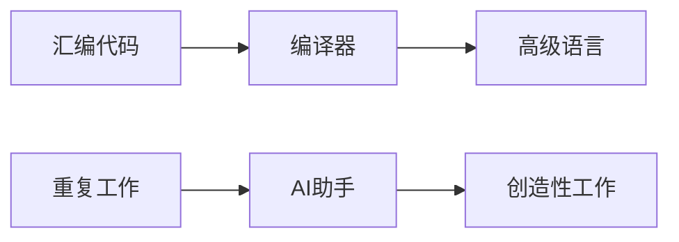

# AI编程助手：像编译器一样的开发工具

## 引言：从编译器说起



记得编译器刚出现时，很多人担心它会取代汇编程序员。但历史告诉我们，它最终成为了程序员最得力的助手。今天，我想分享下使用AI编程助手Cursor的一些深度体验。

## Cursor: 不止于AI编程助手

在谈具体实践之前，我想先分享下Cursor本身的独特魅力。它不仅仅是一个支持AI的编辑器，更像是一个懂你想法的开发伙伴。

### 即时的工作流

还记得第一次使用Cursor的震撼 - 在空白的工作区输入"创建一个React项目，包含状态管理和路由"，几秒钟后，一个完整的项目结构就呈现在眼前。不需要繁琐的项目初始化，不需要手动创建文件夹，一切就这么自然地开始了。

### 上下文感知

最让我惊喜的是Cursor对项目上下文的理解。它会自动向量化我的代码库，这意味着它不只是理解当前文件，而是解整个项目。当我要添加新功能时，它会考虑已有的代码结构和设计模式，给出符合项目风格的建议。

### 无缝的开发体验


传统的copilot更像是一个代码补全工具，而Cursor给我的感觉是一个真正的开发环境 - 从文件创建、代码编写到项目管理，每一步都如行云流水。当我专注于解决问题时，它就在那里，安静但高效地协助我把想法转化为代码。

## 实践一：AI-Realtime项目开发

最近我用Cursor开发了一个ai-realtime的web应用。整个项目80%的代码都是在Cursor的协助下完成的，发布到GitHub后三天就获得了6个star。这个过程让我对AI编程助手有了更深的认识。


## 关键发现：任务拆解的艺术

在开发过程中，我发现如果不能很好地把控代码方向，不重视对修改的版本管理，那么一旦Cursor生成的代码偏离了预期，重做的时间反而会超过自己慢慢写代码。让我们看一个具体的例子：
```typescript
// ❌ 糟糕的提示词
"帮我实现一个websocket连接"
"写一个websocket客户端"
"实现实时通信功能"

// ✅ 好的提示词
"实现一个WebSocket客户端类，需要包含以下功能：
1. 连接状态管理
   - 跟踪连接状态（已连接、正在连接、断开连接）
   - 错误状态处理
   - 提供状态查询接口

2. 心跳检测机制
   - 每30秒发送一次心跳包
   - 监控心跳响应
   - 处理超时情况

3. 自动重连机制
   - 断线后自动重连
   - 使用指数退避算法（最大重试5次）
   - 重连间隔从1秒开始，最大30秒

4. 错误处理
   - 处理连接错误
   - 处理消息发送失败
   - 提供错误回调接口

5. 资源管理
   - 提供优雅的关闭方法
   - 清理定时器和事件监听
   - 处理内存泄漏风险"
```

通过这个对比，我们可以看到，详细的需求描述不仅帮助AI更好地理解我们的意图，也迫使我们自己更清晰地思考问题。这正是AI编程助手的价值所在 - 它不仅是一个代码生成工具，更是一面镜子，反映出我们对问题理解的深度。

## 实践二：文档生成与知识整理

### 运营SOP的编写

最近一个创业的朋友找到我，需要为他的新业务建立一套运营SOP。这是一个很有趣的尝试 - 运营SOP本质上就是结构化的Markdown文档，正好可以利用Cursor在文档生成和文件组织方面的优势。

```typescript
// 告诉Cursor我们的需求
"创建一个运营SOP文档项目，包含以下模块：
- 日常运营规范
- 活动策划流程
- 社群管理指南
- 危机处理预案
每个模块需要单独的markdown文件，并在根目录创建一个索引文件"
```

Cursor立即为我创建了一个完整的文档结构：

```
operations-sop/
├── README.md                 // 项目索引
├── daily-operations.md       // 日常运营规范
├── event-planning.md         // 活动策划流程
├── community-management.md   // 社群管理指南
└── crisis-management.md      // 危机处理预案
```

有了这个基础结构，我们就可以逐个文件完善内容。Cursor的向量化能力在这里特别有用 - 它能理解整个项目的上下文，确保各个文档之间的连贯性。比如，当我们在编写活动策划流程时，它会自动参考日常运营规范中的相关内容，确保整体风格和规则的一致性。

### 家装计划的制定

家装是每个人都会面临的大工程。我想把这个过程变得更有条理，于是开始了一个有趣的尝试。

首先，我用GitHub上的爬虫项目获取了小红书上的家装经验分享数据。数据包括：
- 装修风格案例
- 常见踩坑经历
- 预算控制建议
- 材料选择心得

然后，我让Cursor分析这些数据，并结合我的具体情况：
```typescript
"基于收集的小红书数据，帮我制定家装计划，需要考虑：
1. 我的房型是90平米的两室一厅
2. 预算控制在30万以内
3. 喜欢现代简约风格
4. 需要居家办公空间
5. 重点考虑收纳和采光"
```

Cursor不仅帮我生成了分阶段的装修计划，还根据数据中的经验教训，为每个阶段标注了重点注意事项。比如，在水电阶段，它特别提醒了插座布局和网络布线的考虑点，这些都是从数据中提炼出的经验。

最令人惊喜的是，Cursor会主动关联不同阶段的依赖关系。例如，当讨论到客厅布局时，它会提醒我考虑前期水电改造的预留，这种前后呼应的建议正是得益于它对整个项目上下文的理解。

## 深度思考：工具与创造者的边界

在使用Cursor的这段时间，我经常会想起编译器的故事。还记得在大学时，老师讲述Dennis Ritchie创造C语言编译器的历史 - 当时很多人认为，有了编译器，谁还需要懂汇编呢？但历史告诉我们，编译器不仅没有取代程序员，反而让编程变得更加优雅和富有创造性。

今天的AI编程助手，某种程度上正在经历类似的阶段。当我熟练地使用Cursor后，发现它就像一个"智能编译器" - 不是把高级语言翻译成机器码，而是把我的想法转换成代码实现。但关键在于，这个"转换"过程需要程序员的智慧来引导。

### 新的协作方式

记得在实现WebSocket功能时，我尝试过直接让Cursor"实现一个socket连接"。结果可想而知 - 生成的代码杂乱无章，缺少关键的错误处理和重连机制。这让我意识到，使用AI编程助手的正确方式，是先发挥程序员的专业能力：
- 理解业务需求的本质
- 设计合理的技术方案
- 将复杂问题拆解成可管理的小任务

就像建筑师不会被CAD软件取代一样，程序员的价值也不在于编写每一行代码，而在于构建整体的解决方案。AI编程助手让我们能够更专注于这种高层次的思考。

### 创新的本质

通过开发ai-realtime项目，我深刻体会到：创新不是简单的代码堆砌，而是对问题本质的洞察和巧妙的解决方案。AI可以帮我们更快地实现想法，但想法本身必须来自于人类的创造力。这让我想起了那句老话："工具的进步不会取代思考，只会让思考变得更纯粹。"

## 结语：在工具与创造之间

如今，当我打开编辑器，Cursor就像一位耐心的助手，帮我处理那些"有规律可循"的工作。这让我想起了第一次使用IDE的自动补全功能 - 不再需要记住所有的API文档，可以更专注于业务逻辑的实现。从最早的代码补全，到今天的AI辅助编程，开发工具一直在进化，帮助我们远离机械性的工作。

AI编程助手正在以同样的方式改变着我们的工作方式。它不是来取代程序员的，而是帮助我们摆脱重复性工作的束缚，让我们能够投入更多精力在真正需要人类智慧的地方。这或许就是技术进步的真谛：通过工具的进化，让创造变得更加纯粹。

就像我在使用Cursor写这篇文章时一样 - 它帮我优化语言表达，但思考和感悟，永远需要源于真实的开发体验和对技术本质的理解。